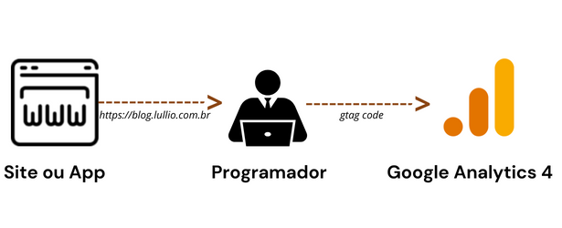
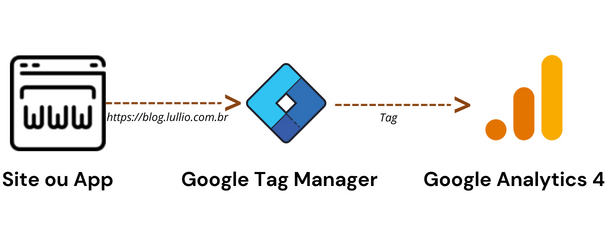
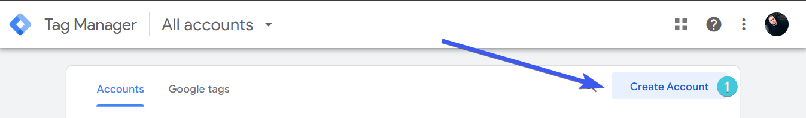
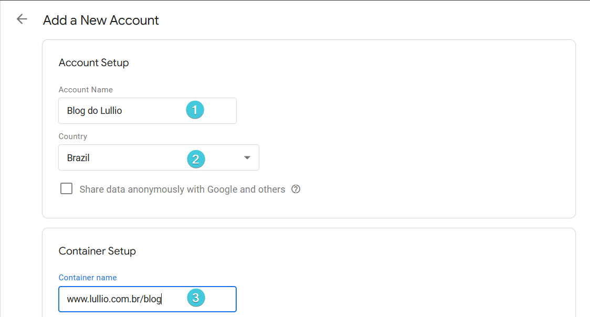
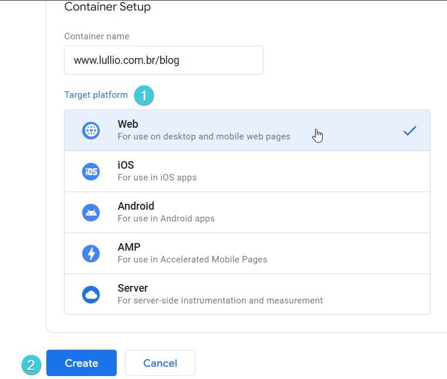
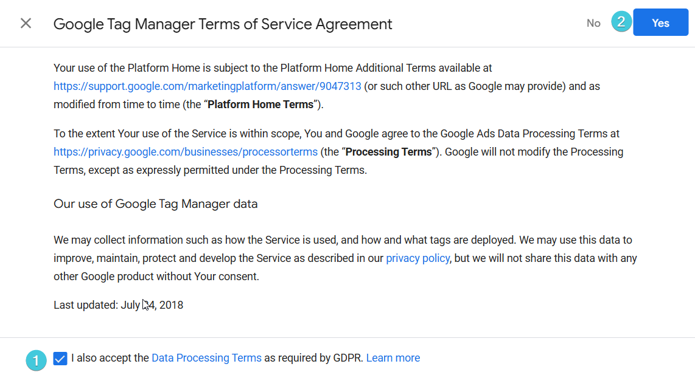
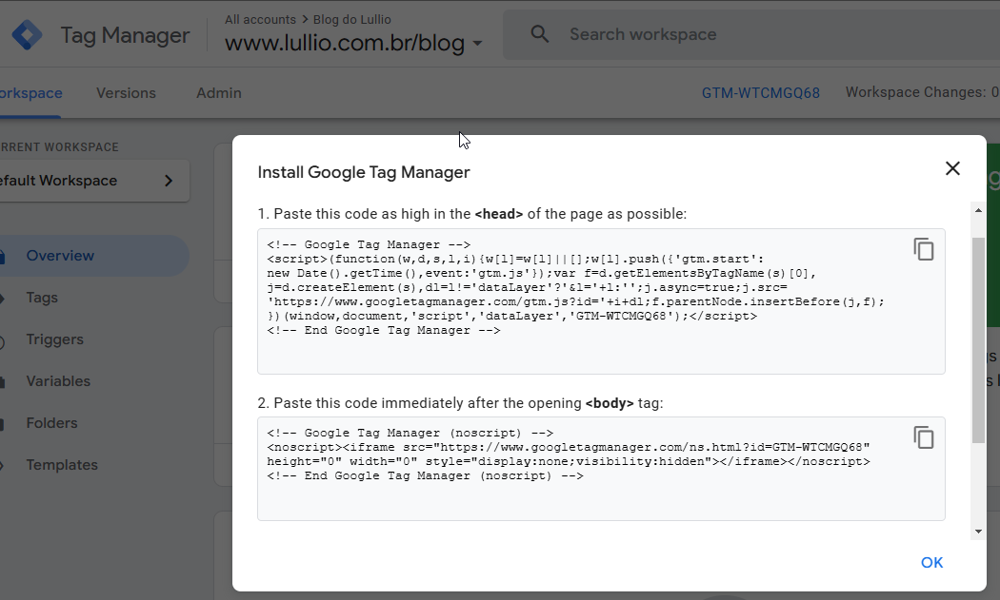
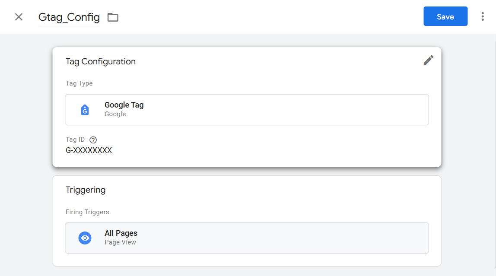

## O que é o Google Tag Manager e por que você precisa dele?

O **Google Tag Manager(GTM)** é uma ferramenta gratuita da Google que permite instalar, armazenar e controlar tags sem precisar editar o código-fonte do site ou aplicativo. Imagine o GTM/Google Tag Manager como uma caixa grande onde você guarda uma lista de tudo que você deseja rastrear e coletar das pessoas que acessam o seu site ou aplicativo. 

## O que são Tags? 
Tags são pequenos trechos de código usados para rastrear e coletar as ações que as pessoas fazem ao visitar um site ou aplicativo. As tags são como pequenos espiões digitais, elas rastreiam ações como cliques em botões, visualizações de páginas, compras, envio de formulários, interações com vídeos e muito mais. Essas informações são essenciais para entender o comportamento do público, otimizar estratégias e aumentar as conversões/vendas. 
Imagine uma tag como um item que você deseja monitorar em seu site, e o Google Tag Manager (GTM) como uma grande caixa onde você armazena e gerencia esses itens de monitoramento.

### Exemplos de tags:
- **Compra em sites de ecommerce**: Você pode ter uma tag para rastrear quando o usuário faz uma compra.
-  **Clique em botões**: Você tem outra tag para monitorar quando o usuário clica em um botão/CTA no seu site ou aplicativo.
- **Google Analytics 4**: Você pode ter uma tag para instalar a ferramenta Google Analytics 4 que automaticamente rastreia o tráfego do seu site e fornece relatórios e insights sobre seus visitantes. [Saiba mais sobre o Google Analytics e por que você precisa dele aqui](/o-que-e-o-google-analytics-4-porque-voce-precisa-dele/).

## Benefícios do Google Tag Manager

1. **Economia de tempo e recursos:** Permite instalar tags sem a necessidade de alterar o código-fonte do site, consolidando tudo em um único local. Você não precisa de um desenvolvedor/programador para instalar as tags, poderá instalar de maneira fácil e rápida usando o GTM.
2. **Maior organização e controle:** Mantenha todas as suas tags em um só lugar, acompanhe o histórico de alterações e caso aconteça algum problema no seu site ou aplicativo, com dois cliques você pode voltar para a versão anterior, quando tudo estava funcionando normalmente. Isso facilita a gestão, proporcionando um ambiente mais controlado, rastreável e flexível.
3. **Integração com diversas ferramentas:** Com poucos cliques você conecta o GTM às suas ferramentas de marketing para ter uma visão completa do seu negócio. Exemplo de integrações nativas: Google Analytics 4(GA4), Google Ads, Meta Ads(Facebook Ads) e muitas outras ferramentas. 
4. **Redução de erros e depuração:** O GTM oferece recursos de teste e depuração integrados, reduzindo o risco de erros na instalação das tags e falhas no site.
5. **Otimização do desempenho do site:** O GTM carrega as tags de forma assíncrona, sem impactar a velocidade do seu site e reduz o risco de impactar a experiência do usuário.
6. **Flexibilidade e personalização:** Consegue criar gatilhos/triggers, variáveis e regras personalizadas para atender às suas necessidades específicas.

## Quem pode usar o Google Tag Manager?

O GTM é ideal para qualquer pessoa que gerencia um site ou aplicativo, desde iniciantes até profissionais experientes em marketing digital. É gratuito, simples de usar e oferece diversos recursos para atender às suas necessidades.
Mesmo desenvolvedores que possuem total controle do código-fonte usam o Google Tag Manager(GTM) devido a sua facilidade, organização e gerenciamento. Você economiza tempo, recursos, além de reduzir a chance de erros e de quebrar o site. 
**O GTM é o seu assistente de rastreamento web e é gratuito.**

### Sem o uso do GTM: Dependência do Desenvolvedor/Programador



Quando você não utiliza um gerenciador de tags, como o GTM, você precisará do desenvolvedor 100% das vezes para atuar em qualquer instalação ou modificação de rastreamento web, mesmo as mais simples, como a instalação de novas ferramentas de análise ou marketing. 


Você quer rastrear eventos, como cliques em botões, visualizações de página ou quer adicionar uma nova ferramenta no seu site. Mas, sem o GTM ou um gerenciador de tags, você precisa recorrer ao programador para cada alteração ou instalação. 


### Com o GTM: Liberdade e Agilidade



Quando você usa um gerenciador de tags, como o Google Tag Manager(GTM), o fluxo fica simplificado e você não precisará do desenvolvedor para todas as atividades.

- Você quer rastrear eventos e adicionar uma nova ferramenta de marketing no seu site, e agora tem um ferramenta gratuita e poderosa à disposição. 
- Você acessa o GTM e cria uma tag com poucos cliques sem tocar no código-fonte e sem recorrer ao desenvolvedor/programador.

## Como instalar o Google Tag Manager

1. **Crie uma conta no Google Tag Manager**: Acesse o [site do GTM](https://tagmanager.google.com/) e clique no botão "Criar conta" localizado no canto superior direito.
   
2. **Adicione os detalhes**: Insira um nome para a Conta(pode ser o nome da sua empresa/negócio ou o nome do seu site), seleciona o país e depois insira a url do seu site.
   
3. **Selecione o tipo de container**: Selecione "Web" caso deseje rastrear eventos para o seu site.
   
4. **Aceite os termos:**: Leia e aceite os termos do serviço do Google Tag Manager.
   
5. **Adicione o código do GTM ao seu site ou aplicativo**: Logo em seguida você será redirecionado para uma tela com o código e as instruções de onde inserir o código de instalação do Google Tag Manager
   

Insira o código abaixo na tag  `<head>` do seu site, substuindo o GTM-XXXXXXXX pelo id do seu container GTM.

```html
<!-- Google Tag Manager -->
<script>(function(w,d,s,l,i){w[l]=w[l]||[];w[l].push({'gtm.start':
new Date().getTime(),event:'gtm.js'});var f=d.getElementsByTagName(s)[0],
j=d.createElement(s),dl=l!='dataLayer'?'&l='+l:'';j.async=true;j.src=
'https://www.googletagmanager.com/gtm.js?id='+i+dl;f.parentNode.insertBefore(j,f);
})(window,document,'script','dataLayer','GTM-XXXXXXXX');</script>
<!-- End Google Tag Manager -->
```

Insira o código abaixo na tag `<body>` do seu site, substuindo o GTM-XXXXXXXX pelo id do seu container GTM.

```html
<!-- Google Tag Manager (noscript) -->
<noscript><iframe src="https://www.googletagmanager.com/ns.html?id=GTM-XXXXXXXX"
height="0" width="0" style="display:none;visibility:hidden"></iframe></noscript>
<!-- End Google Tag Manager (noscript) -->
```

## Compare a mesma Tag inserida no Google Tag Manager e no código-fonte do site

### Tag inserida no código do site:

```html
<!-- Google tag (gtag.js) -->
<script async src="https://www.googletagmanager.com/gtag/js?id=G-XXXXXXXX"></script>
<script>
  window.dataLayer = window.dataLayer || [];
  function gtag(){dataLayer.push(arguments);}
  gtag('js', new Date());

  gtag('config', 'G-XXXXXXXX');
</script>
```
### Mesma Tag no GTM:



## Conclusão
O Google Tag Manager é gerenciador de tags e uma ferramenta essencial para qualquer profissional de marketing digital e qualquer empresa que deseja gerenciar e otimizar o rastreamento de seu site ou aplicativo. Com sua interface amigável, recursos poderosos e flexibilidade, o GTM atua como um facilitador, permitindo que você instale, remova, gerencie e organize todo o rastreamento, tags e scripts sem a necessidade de um programador/desenvolvedor.